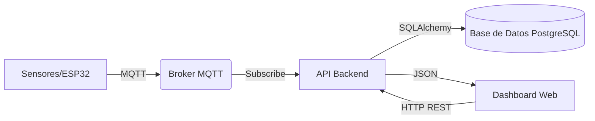

# 📘 Manual Técnico - Sistema de Monitoreo Avícola

## 1. Descripción General del Sistema
Este documento detalla la arquitectura técnica, componentes y flujos de datos del Sistema de Monitoreo Avícola Inteligente. El sistema está diseñado para capturar datos ambientales en tiempo real, procesarlos, almacenarlos y presentarlos mediante una interfaz web interactiva.

## 2. Arquitectura del Sistema
El sistema opera bajo un modelo **Cliente-Servidor** con arquitectura de microservicios e integración **IoT**.

### 2.1 Diagrama de Flujo de Datos

### 2.2 Tecnologías Utilizadas
*   **Lenguaje**: Python 3.9+
*   **Framework Web**: Flask
*   **Base de Datos**: PostgreSQL / SQLite (Entornos de desarrollo)
*   **Protocolo IoT**: MQTT (Mosquitto)
*   **Frontend**: HTML5, CSS3, JavaScript (Vanilla), Bootstrap 5
*   **Contenedores**: Docker & Docker Compose

## 3. Diccionario de Datos

### 3.1 Tabla: `users` (Usuarios)
Almacena la información de acceso y perfil de los administradores y operarios.
| Campo | Tipo | Descripción |
| :--- | :--- | :--- |
| `id` | Integer (PK) | Identificador único |
| `username` | String(80) | Nombre de usuario para login |
| `password_hash` | String(256) | Hash seguro de contraseña |
| `role` | String(50) | Rol (Admin, User) |

### 3.2 Tabla: `lecturas` (Datos de Sensores)
Registro histórico de todas las mediciones enviadas por los módulos.
| Campo | Tipo | Descripción |
| :--- | :--- | :--- |
| `id_lectura` | String (PK) | UUID generado por el sensor |
| `modulo` | String | Identificador del módulo (ej: "M1") |
| `hora` | DateTime | Timestamp de la medición |
| `temperatura` | Float | Valor en °C |
| `humedad` | Float | Valor en % |
| `co`, `co2`, `amoniaco` | Float | Valores en ppm |

### 3.3 Tabla: `alertas` (Sistema de Alertas)
Registro de eventos críticos generados automáticamente.
| Campo | Tipo | Descripción |
| :--- | :--- | :--- |
| `tipo` | String | Variable afectada (temperatura, etc.) |
| `prioridad` | String | `critical`, `warning`, `info` |
| `estado` | String | `active`, `acknowledged`, `resolved` |
| `umbral` | Float | Valor límite que detonó la alerta |

## 4. Documentación de API (Endpoints Principales)

### Módulo de Sensores (MQTT/Ingesta)
*   **POST** `/lecturas`: Recibe JSON con datos crudos de sensores.
    *   *Payload*: `{"id_lectura": "...", "modulo": "M1", "temperatura": 25.4, ...}`

### Módulo de Alertas
*   **GET** `/api/alerts`: Obtiene lista de alertas filtradas por estado/prioridad.
*   **DELETE** `/api/alerts/all`: **[NUEVO]** Elimina todas las alertas de la base de datos (Admin only).
*   **PUT** `/api/alerts/mark-all`: Marca todas las alertas activas como "Vistas".

### Módulo Histórico
*   **GET** `/api/historical`: Retorna series de tiempo para gráficos.
    *   *Params*: `range` (1h, 24h, 7d), `house` (Módulo).

## 5. Lógica de Negocio

### 5.1 Sistema de Alertas y Throttling
Para evitar saturación de notificaciones, el sistema implementa una lógica de **Debounce (Throttling)**:
1.  Al recibir una lectura, se compara contra la tabla `umbrales`.
2.  Si supera un límite, se busca la **última alerta** del mismo tipo y módulo.
3.  **Regla de 60 segundos**: Si existe una alerta previa creada hace menos de 60 segundos, la nueva se descarta.
4.  Si han pasado >60s, se crea una nueva alerta en estado `active`.

## 6. Despliegue e Instalación
El proyecto incluye archivos `Dockerfile` para cada servicio. Para desplegar en producción:
1.  Configurar variables de entorno en `.env`.
2.  Ejecutar: `docker-compose up -d --build`.
3.  Verificar logs: `docker-compose logs -f`.
