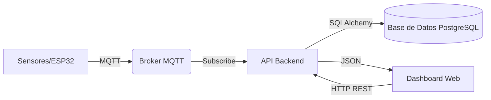
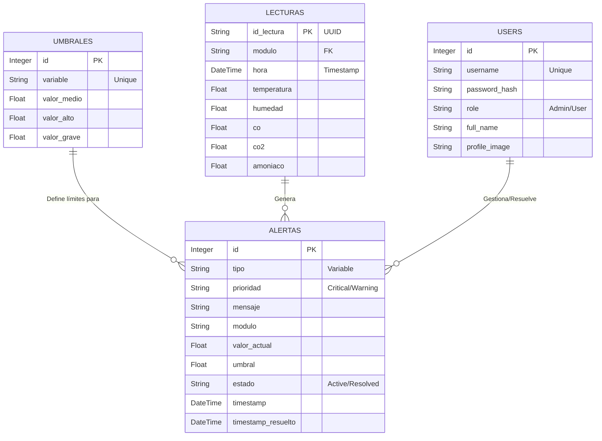

# 📘 Manual Técnico - Sistema de Monitoreo Avícola

## 1. Descripción General del Sistema
Este documento detalla la arquitectura técnica, componentes y flujos de datos del Sistema de Monitoreo Avícola Inteligente. El sistema está diseñado para capturar datos ambientales en tiempo real, procesarlos, almacenarlos y presentarlos mediante una interfaz web interactiva.

## 2. Arquitectura del Sistema
El sistema opera bajo un modelo **Cliente-Servidor** con arquitectura de microservicios e integración **IoT**.

### 2.1 Diagrama de Flujo de Datos


### 2.2 Tecnologías Utilizadas (Tech Stack)

| Área | Stack Tecnológico |
| :--- | :--- |
| **Backend Core** |    |
| **Frontend UI** |    |
| **IoT & Protocolos** |   |
| **Base de Datos** |  |
| **Infraestructura** |   |

## 3. Modelo de Datos (Diagrama Entidad-Relación)

A continuación se presenta el esquema relacional de la base de datos diseñado para garantizar integridad y rapidez en consultas de series de tiempo.



### Descripción de Tablas

*   **USERS**: Gestión de acceso, roles y perfiles de operarios.
*   **LECTURAS**: Tabla transaccional de alto volumen. Almacena cada "latido" (heartbeat) enviado por los sensores IoT.
*   **ALERTAS**: Bitácora de incidencias. Implementa lógica de estados (Activo -> Reconocido -> Resuelto) para trazabilidad.
*   **UMBRALES**: Tabla de configuración dinámica. Permite ajustar la sensibilidad del sistema sin tocar código.

## 4. Documentación de API (Endpoints Principales)

### Módulo de Sensores (MQTT/Ingesta)
*   **POST** `/lecturas`: Recibe JSON con datos crudos de sensores.
    *   *Payload*: `{"id_lectura": "...", "modulo": "M1", "temperatura": 25.4, ...}`

### Módulo de Alertas
*   **GET** `/api/alerts`: Obtiene lista de alertas filtradas por estado/prioridad.
*   **DELETE** `/api/alerts/all`: **[NUEVO]** Elimina todas las alertas de la base de datos (Admin only).
*   **PUT** `/api/alerts/mark-all`: Marca todas las alertas activas como "Vistas".

### Módulo Histórico
*   **GET** `/api/historical`: Retorna series de tiempo para gráficos.
    *   *Params*: `range` (1h, 24h, 7d), `house` (Módulo).

## 5. Lógica de Negocio Detallada

### 5.1 Seguridad y Autenticación (Login)
El sistema implementa un esquema de seguridad robusto para proteger el acceso a los datos sensibles.

**Flujo de Autenticación:**
1.  **Modelo de Usuario (`User`)**: Hereda de `flask_login.UserMixin` para integración nativa con el gestor de sesiones.
2.  **Hashing de Contraseñas**:
    *   **NUNCA** se almacenan contraseñas en texto plano.
    *   Se utiliza `werkzeug.security.generate_password_hash` con el algoritmo PBKDF2-SHA256 y "salting" automático.
    *   Al hacer login, se verifica con `check_password_hash`.
3.  **Gestión de Sesiones**:
    *   Se utiliza `LoginManager` de Flask-Login.
    *   Protección de rutas mediante decorador `@login_required`.
    *   Protección CSRF habilitada implícitamente en formularios.

**Medidas de Protección Activa:**
1.  **Rate Limiting (Anti-Fuerza Bruta)**:
    *   Implementado con `Flask-Limiter`.
    *   **Login**: Limitado a 10 intentos por minuto por IP.
    *   **Registro**: Limitado a 5 cuentas por hora por IP (Anti-Spam).
    *   **API General**: Límite global de 200 peticiones diarias.
2.  **Cabeceras de Seguridad HTTP (Security Headers)**:
    Se inyectan automáticamente en cada respuesta del servidor:
    *   `X-Content-Type-Options: nosniff`: Evita ataques de confusión de tipo MIME.
    *   `X-Frame-Options: SAMEORIGIN`: Previene ataques de "Clickjacking" (no se puede embeber la web en un iframe externo).
    *   `X-XSS-Protection: 1; mode=block`: Filtro nativo contra Cross-Site Scripting.

### 5.2 Lógica de Umbrales Dinámicos
La detección de anomalías no está "hardcodeada" en el código, sino que es configurada dinámicamente en la base de datos para permitir ajustes en tiempo de ejecución.

**Estructura del Umbral:**
Cada variable (ej: Temperatura) tiene 3 niveles de severidad definidos en la tabla `umbrales`:
*   `valor_medio`: Punto de referencia ideal (Informativo).
*   `valor_alto`: Primer nivel de alarma -> Genera alerta **WARNING** (🟡).
*   `valor_grave`: Nivel crítico -> Genera alerta **CRITICAL** (🔴).

**Algoritmo de Evaluación (Pseudocódigo):**
```python
Para cada nueva lectura recibida del sensor:
    1. Obtener configuración de umbrales desde DB.
    2. Comparar valor actual:
       SI valor >= umbral.valor_grave:
           Prioridad = "CRITICAL"
           Mensaje = "Peligro: Valor X superó límite grave"
       SINO SI valor >= umbral.valor_alto:
           Prioridad = "WARNING"
           Mensaje = "Atención: Valor X alto"
       SINO:
           Ignorar (Estado Normal)
    
    3. (Paso Throttling) Verificar si hubo una alerta idéntica hace < 60s.
    4. SI pasa validaciones -> INSERT en tabla 'alertas'.
```

### 5.3 Sistema de Throttling (Anti-Spam)
Para evitar saturación de notificaciones...

## 6. Despliegue Local en Raspberry Pi (Modo Offline)
El sistema está optimizado para funcionar en una **Raspberry Pi 4 (o superior)** ubicada físicamente en la granja, permitiendo operación continua sin necesidad de internet.

### 6.1 Requisitos Previos
*   Raspberry Pi con **Raspberry Pi OS (64-bits)** instalado.
*   `git` y `docker` instalados.

### 6.2 Configuración de Red (IP Estática) 🌐
Es crucial que la Raspberry tenga una IP fija para que el Dashboard siempre sea accesible.

1.  Dar permisos y ejecutar el script de red incluido:
    ```bash
    chmod +x setup_network.sh
    # Si usa cable Ethernet:
    sudo ./setup_network.sh eth0
    # Si usa WiFi (recomendado):
    sudo ./setup_network.sh wlan0
    ```
    *Esto fijará la IP a `192.168.0.100`.*

### 6.3 Instalación Paso a Paso
1.  **Clonar el Repositorio en la RPi**:
    ```bash
    git clone https://github.com/LUISFERNANDOG2/sistema-avicola-iot.git
    cd sistema-avicola-iot
    ```

2.  **Configurar Variables**:
    Copie el archivo de ejemplo para producción:
    ```bash
    cp .env.example .env
    ```
    *Nota: En entorno local aislado, las contraseñas por defecto son seguras.*

3.  **Iniciar el Sistema (Modo Raspberry)**:
    Utilice el archivo de composición específico para arquitectura ARM (Raspberry Pi):
    ```bash
    docker-compose -f docker-compose.raspberry.yml up -d --build
    ```
    *(Este proceso puede tardar 10-15 minutos la primera vez mientras compila las imágenes)*

4.  **Acceder al Dashboard**:
    Si está conectado a la red de la granja:
    *   IP de la Raspberry: `http://192.168.X.X:5001`
    *   IP Local (si usa pantalla conectada): `http://localhost:5001`

5.  **Apagar el sistema (Raspberry)**:
    ```bash
    docker-compose -f docker-compose.raspberry.yml down
    ```

### 6.3 Configuración de "Punto de Acceso" (Access Point)
Si no hay router en la granja, la Raspberry Pi puede generar su propia red WiFi para que los módulos ESP32 se conecten a ella.
1.  Utilice scripts como `raspap` o configure `hostapd`.
2.  Nombre de red recomendado: `GranjaAvicola_WiFi`.
3.  Configure los módulos ESP32 con esa SSID y contraseña.

### 6.4 Configuración de Autoinicio (Anti-Apagones) 💡
Para asegurar que el sistema arranque automáticamente si se va la luz:

1.  Otorgue permisos de ejecución al script incluido:
    ```bash
    chmod +x setup_autostart.sh
    ```
2.  Ejecute el script de configuración:
    ```bash
    ./setup_autostart.sh
    ```
    *Esto habilitará el servicio Docker en el arranque del sistema operativo y configurará la política de reinicio de los contenedores a `always`.*

### 6.5 Mantenimiento de Base de Datos
Si necesita inspeccionar los datos manualmente dentro del contenedor de base de datos:

1.  **Entrar al contenedor PostgreSQL**:
    ```bash
    docker exec -it sistema-avicola-iot-db-1 psql -U avicola_user -d avicola_db
    ```
    *(Nota: El nombre del contenedor puede variar, use `docker ps` para verificarlo)*

2.  **Comandos útiles SQL**:
    ```sql
    \dt                  -- Listar tablas
    SELECT * FROM users; -- Ver usuarios registrados
    SELECT count(*) FROM lecturas; -- Contar total de registros
    \q                   -- Salir
    ```

## 7. Despliegue en Servidor Cloud (Opcional)
Para despliegue en AWS/Azure...
