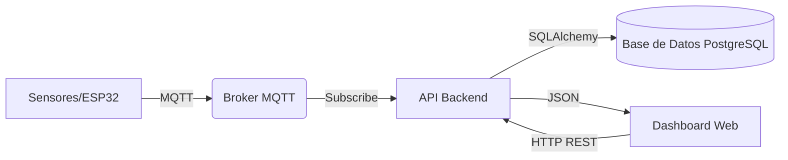
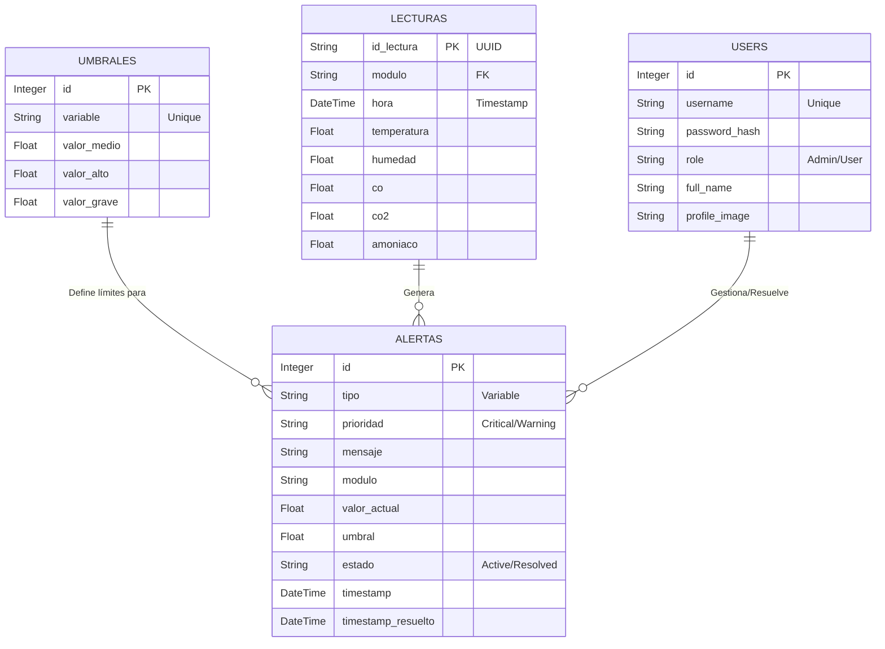

# 📘 Manual Técnico - Sistema de Monitoreo Avícola

## 1. Descripción General del Sistema
Este documento detalla la arquitectura técnica, componentes y flujos de datos del Sistema de Monitoreo Avícola Inteligente. El sistema está diseñado para capturar datos ambientales en tiempo real, procesarlos, almacenarlos y presentarlos mediante una interfaz web interactiva.

## 2. Arquitectura del Sistema
El sistema opera bajo un modelo **Cliente-Servidor** con arquitectura de microservicios e integración **IoT**.

### 2.1 Diagrama de Flujo de Datos


### 2.2 Tecnologías Utilizadas (Tech Stack)

| Área | Stack Tecnológico |
| :--- | :--- |
| **Backend Core** |    |
| **Frontend UI** |    |
| **IoT & Protocolos** |   |
| **Base de Datos** |  |
| **Infraestructura** |   |

## 3. Modelo de Datos (Diagrama Entidad-Relación)

A continuación se presenta el esquema relacional de la base de datos diseñado para garantizar integridad y rapidez en consultas de series de tiempo.



### Descripción de Tablas

*   **USERS**: Gestión de acceso, roles y perfiles de operarios.
*   **LECTURAS**: Tabla transaccional de alto volumen. Almacena cada "latido" (heartbeat) enviado por los sensores IoT.
*   **ALERTAS**: Bitácora de incidencias. Implementa lógica de estados (Activo -> Reconocido -> Resuelto) para trazabilidad.
*   **UMBRALES**: Tabla de configuración dinámica. Permite ajustar la sensibilidad del sistema sin tocar código.

## 4. Documentación de API (Endpoints Principales)

### Módulo de Sensores (MQTT/Ingesta)
*   **POST** `/lecturas`: Recibe JSON con datos crudos de sensores.
    *   *Payload*: `{"id_lectura": "...", "modulo": "M1", "temperatura": 25.4, ...}`

### Módulo de Alertas
*   **GET** `/api/alerts`: Obtiene lista de alertas filtradas por estado/prioridad.
*   **DELETE** `/api/alerts/all`: **[NUEVO]** Elimina todas las alertas de la base de datos (Admin only).
*   **PUT** `/api/alerts/mark-all`: Marca todas las alertas activas como "Vistas".

### Módulo Histórico
*   **GET** `/api/historical`: Retorna series de tiempo para gráficos.
    *   *Params*: `range` (1h, 24h, 7d), `house` (Módulo).

## 5. Lógica de Negocio Detallada

### 5.1 Seguridad y Autenticación (Login)
El sistema implementa un esquema de seguridad robusto para proteger el acceso a los datos sensibles.

**Flujo de Autenticación:**
1.  **Modelo de Usuario (`User`)**: Hereda de `flask_login.UserMixin` para integración nativa con el gestor de sesiones.
2.  **Hashing de Contraseñas**:
    *   **NUNCA** se almacenan contraseñas en texto plano.
    *   Se utiliza `werkzeug.security.generate_password_hash` con el algoritmo PBKDF2-SHA256 y "salting" automático.
    *   Al hacer login, se verifica con `check_password_hash`.
3.  **Gestión de Sesiones**:
    *   Se utiliza `LoginManager` de Flask-Login.
    *   Protección de rutas mediante decorador `@login_required`. Si un usuario no autenticado intenta entrar a `/dashboard`, es redirigido forzosamente a `/login`.
    *   Protección CSRF (Cross-Site Request Forgery) habilitada implícitamente en formularios.

### 5.2 Lógica de Umbrales Dinámicos
La detección de anomalías no está "hardcodeada" en el código, sino que es configurada dinámicamente en la base de datos para permitir ajustes en tiempo de ejecución.

**Estructura del Umbral:**
Cada variable (ej: Temperatura) tiene 3 niveles de severidad definidos en la tabla `umbrales`:
*   `valor_medio`: Punto de referencia ideal (Informativo).
*   `valor_alto`: Primer nivel de alarma -> Genera alerta **WARNING** (🟡).
*   `valor_grave`: Nivel crítico -> Genera alerta **CRITICAL** (🔴).

**Algoritmo de Evaluación (Pseudocódigo):**
```python
Para cada nueva lectura recibida del sensor:
    1. Obtener configuración de umbrales desde DB.
    2. Comparar valor actual:
       SI valor >= umbral.valor_grave:
           Prioridad = "CRITICAL"
           Mensaje = "Peligro: Valor X superó límite grave"
       SINO SI valor >= umbral.valor_alto:
           Prioridad = "WARNING"
           Mensaje = "Atención: Valor X alto"
       SINO:
           Ignorar (Estado Normal)
    
    3. (Paso Throttling) Verificar si hubo una alerta idéntica hace < 60s.
    4. SI pasa validaciones -> INSERT en tabla 'alertas'.
```

### 5.3 Sistema de Throttling (Anti-Spam)
Para evitar saturación de notificaciones...

## 6. Despliegue e Instalación
El proyecto incluye archivos `Dockerfile` para cada servicio. Para desplegar en producción:
1.  Configurar variables de entorno en `.env`.
2.  Ejecutar: `docker-compose up -d --build`.
3.  Verificar logs: `docker-compose logs -f`.
