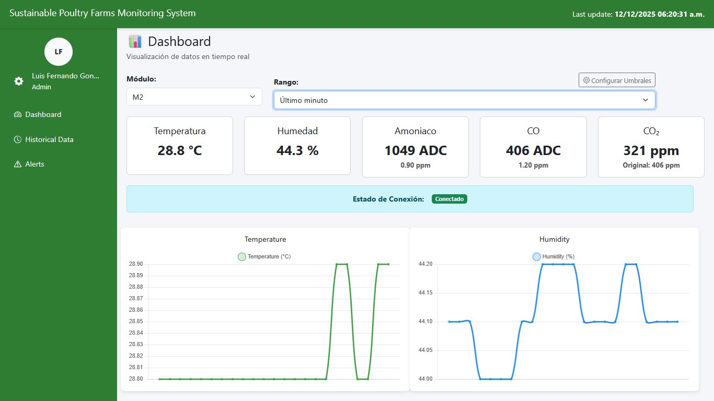
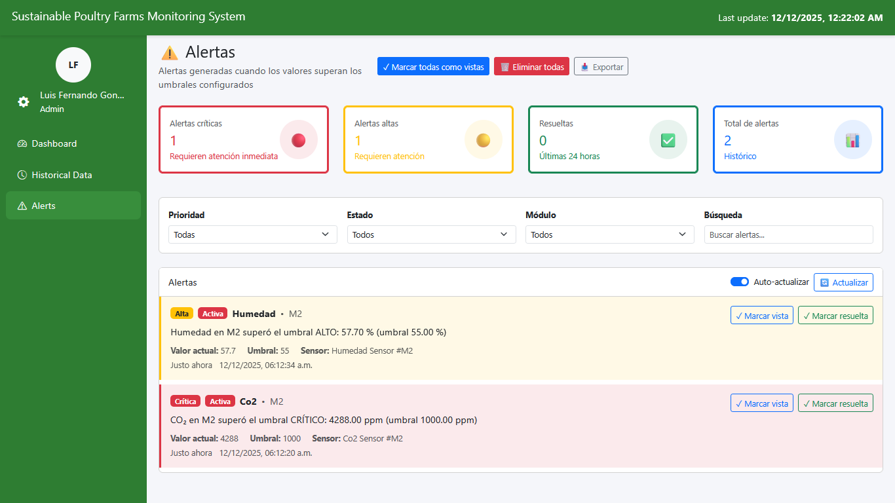
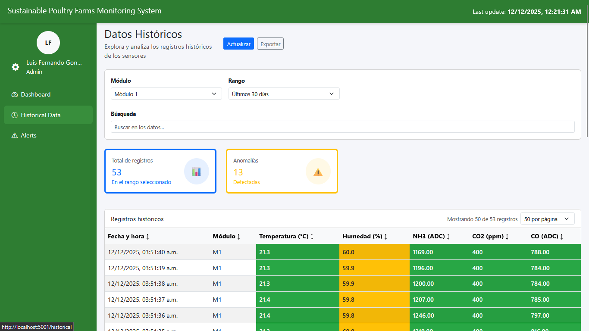
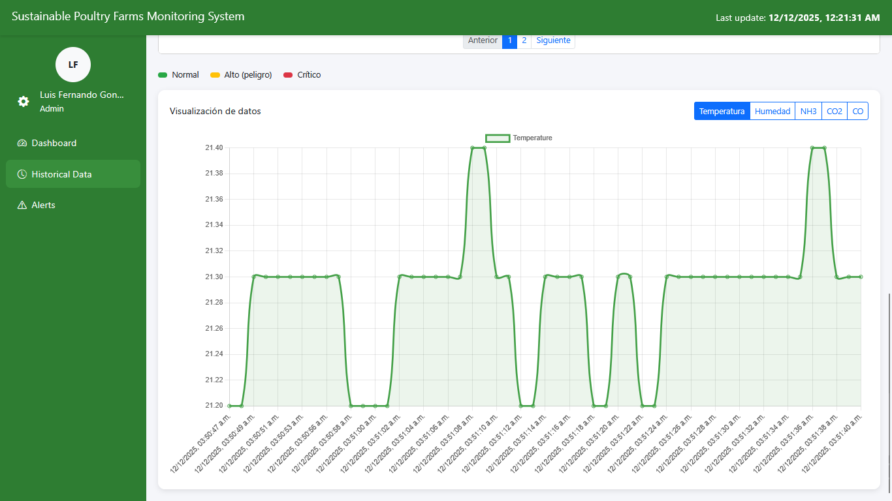
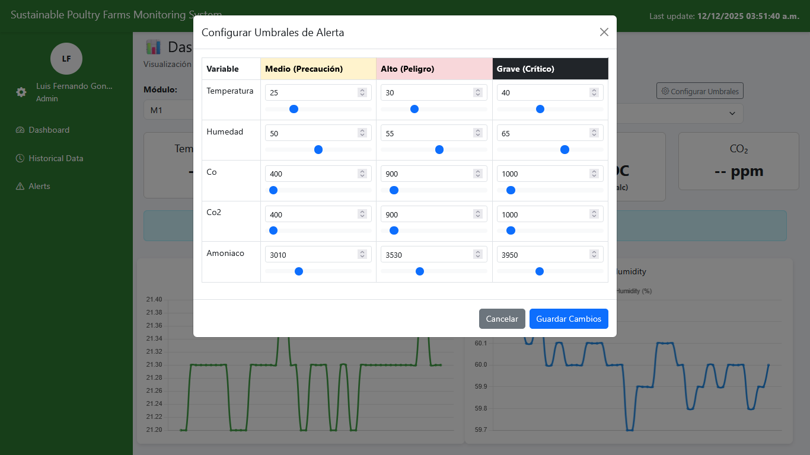
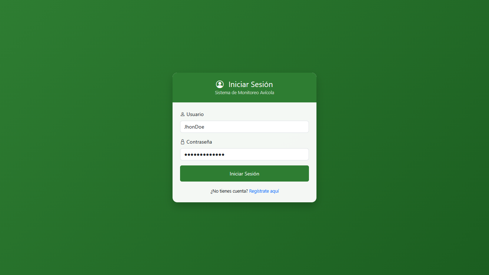

# 🐔 Sistema de Monitoreo Avícola Inteligente (Smart Poultry System)

Este proyecto es una solución integral IoT (Internet of Things) diseñada para la gestión, monitoreo y análisis automatizado de granjas avícolas. Permite supervisar variables críticas (temperatura, humedad, amoniaco, CO2) en tiempo real, recibir alertas inteligentes y analizar datos históricos para mejorar la productividad.

---

## 📸 Galería del Sistema
<br>

**Panel de Control & Monitoreo**
<p align="center">
  
  
</p>

**Análisis de Datos**
<p align="center">
  
  
</p>

**Configuración & Acceso**
<p align="center">
  
  
  
</p>

---

## 🚀 Características Principales

*   **📊 Dashboard en Tiempo Real**: Visualización instantánea de lecturas de sensores con indicadores de estado (Normal, Advertencia, Peligro).
*   **⚠️ Sistema de Alertas Inteligente**: Notificaciones automáticas cuando las variables superan umbrales predefinidos. Incluye lógica *anti-spam* y gestión de estados (Activa/Resuelta).
*   **📈 Análisis Histórico**: Gráficas interactivas para analizar tendencias en rangos de tiempo configurables (24h, 7 días, o rangos personalizados).
*   **🤖 Integración IoT**: Arquitectura robusta vía MQTT para recibir datos de múltiples módulos de sensores (ESP32).
*   **🧠 Módulo de IA/ML**: Scripts y notebooks de análisis de datos (`ML/`) para clustering y predicción de patrones ambientales.
*   **👥 Gestión de Usuarios**: Sistema de roles y autenticación segura.

---

## 🛠️ Arquitectura del Sistema

El sistema sigue una arquitectura de microservicios modular:

1.  **Módulos IoT (Edge)**: Dispositivos ESP32 que recolectan datos de sensores y los envían vía MQTT.
2.  **Broker MQTT**: Gestiona la cola de mensajes entre los sensores y el backend.
3.  **API Backend (Flask)**:
    *   Procesa mensajes MQTT.
    *   Gestiona la lógica de negocio y alertas.
    *   Interactúa con la Base de Datos (PostgreSQL).
4.  **Base de Datos**: Almacena usuarios, lecturas históricas, alertas y configuraciones de umbrales.
5.  **Dashboard Frontend**: Interfaz web responsiva para el usuario final.

---

## 📂 Estructura del Proyecto

```
Proyecto-Avicola/
├── api_avicola/          # Backend: API, Modelos DB, Lógica de Alertas
├── dashboard_avicola/    # Frontend: Web App, Templates HTML, Estilos
├── Modulos_IoT/          # Firmware para dispositivos ESP32
├── ML/                   # Análisis de Datos: Jupyter Notebooks y Datasets
├── docker-compose.yml    # Orquestación de contenedores
├── run_api.py            # Script de inicio rápido API
├── run_dashboard.py      # Script de inicio rápido Dashboard
└── requirements.txt      # Dependencias de Python
```

---

## ⚙️ Instalación y Uso

### Opción A: Usando Docker (Recomendada)

Si tienes Docker instalado, puedes levantar todo el sistema con un solo comando:

```bash
docker-compose up -d --build
```
Esto iniciará:
*   Base de datos PostgreSQL.
*   Broker MQTT (Mosquitto).
*   API Backend (Puerto 5000).
*   Dashboard (Puerto 5001).

### Opción B: Ejecución Manual (Local)

1.  **Entorno Virtual**:
    Crea y activa un entorno virtual de Python:
    ```bash
    python -m venv venv
    # Windows
    .\venv\Scripts\activate
    # Linux/Mac
    source venv/bin/activate
    ```

2.  **Instalar Dependencias**:
    ```bash
    pip install -r requirements.txt
    ```

3.  **Configuración**:
    Asegúrate de tener un archivo `.env` en la raíz con la configuración de tu base de datos (ver `.env.example`).

4.  **Ejecutar Servicios**:
    Necesitarás 3 terminales diferentes:

    *   Terminal 1 (Broker MQTT): Asegúrate de tener un broker corriendo o usa Docker para este servicio.
    *   Terminal 2 (API):
        ```bash
        python run_api.py
        ```
    *   Terminal 3 (Dashboard):
        ```bash
        python run_dashboard.py
        ```

5.  **Acceso**:
    *   Abre tu navegador en: `http://localhost:5001`
    *   Usuario por defecto: **admin** (Regístrate si es la primera vez).

---

## 🧪 Pruebas y Simulación

Para verificar el sistema sin sensores físicos, puedes inyectar datos falsos al tópico MQTT configurado o usar los scripts de prueba en `debug/`.

---

## 📝 Créditos de Desarrollo

Proyecto desarrollado como **Residencia Profesional**.
*   **Desarrollador**: Luis Fernando González González
*   **Tecnologías**: Python, Flask, Javascript, Bootstrap, PostgreSQL, MQTT, Docker.

---

> *Este software es para fines educativos y de monitoreo. Asegúrese de calibrar correctamente los sensores antes de su implementación en producción.*
